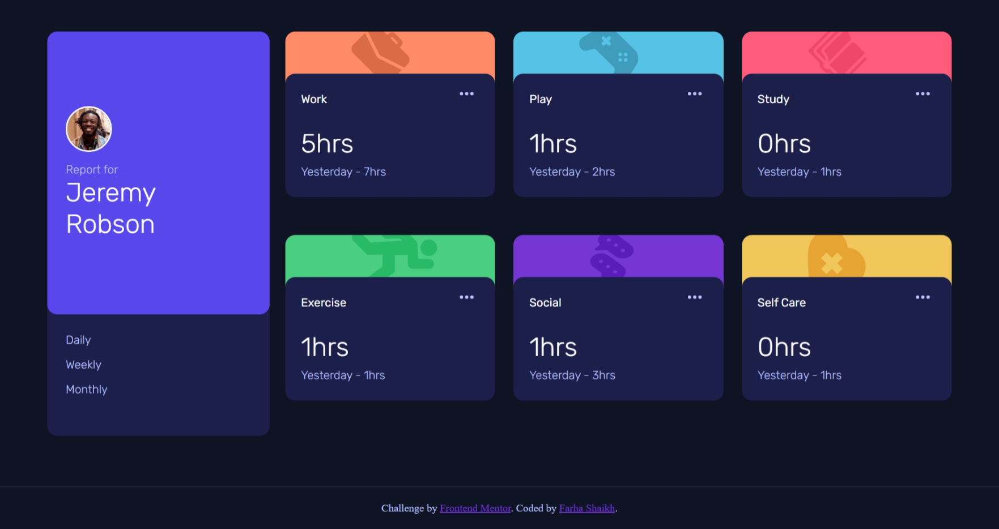

# Frontend Mentor - Time tracking dashboard solution

This is a solution to the [Time tracking dashboard challenge on Frontend Mentor](https://www.frontendmentor.io/challenges/time-tracking-dashboard-UIQ7167Jw). Frontend Mentor challenges help you improve your coding skills by building realistic projects.

## Table of contents

- [Overview](#overview)
  - [The challenge](#the-challenge)
  - [Screenshot](#screenshot)
  - [Links](#links)
- [My process](#my-process)
  - [Built with](#built-with)
  - [What I learned](#what-i-learned)
- [Author](#author)

## Overview

### The challenge

Users should be able to:

- View the optimal layout for the site depending on their device's screen size
- See hover states for all interactive elements on the page
- Switch between viewing Daily, Weekly, and Monthly stats

### Screenshot

### Links

- Solution URL: [https://github.com/GraceRosario/time-tracking-dashboard-main](https://github.com/GraceRosario/time-tracking-dashboard-main)
- Live Site URL: [https://gracerosario.github.io/time-tracking-dashboard-main/](https://gracerosario.github.io/time-tracking-dashboard-main/)

## My process

### Built with

- Semantic HTML5 markup
- CSS custom properties
- Flexbox
- CSS Grid
- Mobile-first workflow

### What I learned

This project helped me move from static layouts to building a dynamic, data-driven UI. I learned how to fetch external JSON data using fetch() and async/await, then render it into the DOM using .map() instead of hardcoding HTML. I implemented timeframe filtering (daily, weekly, monthly) by using a single state variable and dynamic object access (object[key]), which allowed me to update both data and UI based on user interaction. I also used data-\* attributes (dataset) to connect HTML elements with JavaScript logic, and created a label mapping system to display the correct text like “Yesterday”, “Last Week”, and “Last Month.” Along the way, I improved my understanding of DOM manipulation, event handling, and managing UI state by toggling active classes. I practiced writing cleaner, more structured CSS with consistent class naming, and learned to remove redundant static markup once dynamic rendering was in place. Overall, this project strengthened my understanding of how to structure data, keep logic consistent across HTML, CSS, and JavaScript, and build interactive components in a more maintainable way.

## Author

- Frontend Mentor - [@GraceRosario](https://www.frontendmentor.io/profile/GraceRosario)
